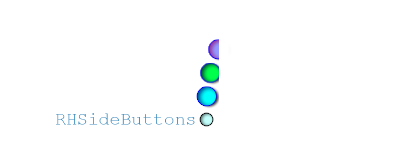
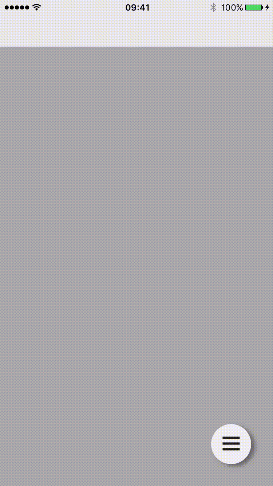
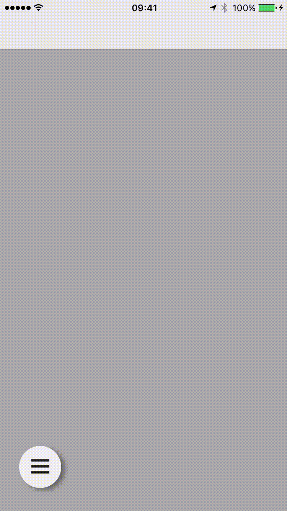

[](http://cocoadocs.org/docsets/RHSideButtons)
[](/LICENSE)
[](https://developer.apple.com/iphone/index.action)
[](https://developer.apple.com/swift)

# RHSideButtons 🌶
Library provides easy to implement variation of Android (Material Design) Floating Action Button for iOS. You can use it as your app small side menu. 🌶

## Play with it 😎

## Installation
You can install RHSideButtons library using CocoaPods:
```
pod 'RHSideButtons'
```
or you can simply copy ```RHSideButtons``` folder to your project.

## Usage
You just need implement `RHSideButtonsDataSource` and `RHSideButtonsDelegate` similar to well-known UIKit design.

```swift
// You need to firstly create trigger button. You can do this using block or your builder object which should conform to 'RHButtonViewConfigProtocol'
// RHTriggerButtonView allows you to change image for pressed state! 👌🏻
let triggerButton = RHTriggerButtonView(pressedImage: UIImage(named: "exit_icon")!) {
    $0.image = UIImage(named: "trigger_img")
    $0.hasShadow = true
}

// Then you need to create instance of SideButtons coordinator class with your View Controller view (it can be even TableView)
sideButtonsView = RHSideButtons(parentView: view, triggerButton: triggerButton)
sideButtonsView.delegate = self
sideButtonsView.dataSource = self

// When SideButtons controller is initialized properly you should set thier position in view in e.g. viewWillAppear method:
override func viewWillAppear(animated: Bool) {
    super.viewWillAppear(animated)

    sideBttns?.setTriggerButtonPosition(CGPoint(x: bounds.width - 85, y: bounds.height - 85))
}
```

... let us prepare our data models for buttons 💥 below you can see one of many ways to do this:

```swift
//Finally you should create array of buttons which will feed our dataSource and Delegate methods :) e.g.:
let button_1 = RHButtonView {
    $0.image = UIImage(named: "icon_1")
    $0.hasShadow = true
}

let button_2 = RHButtonView {
    $0.image = UIImage(named: "icon_2")
    $0.hasShadow = true
}

let button_3 = RHButtonView {
    $0.image = UIImage(named: "icon_3")
    $0.hasShadow = true
}

buttonsArr.appendContentsOf([button_1, button_2, button_3])

//Similar as it is in TableView, now you should reload buttons with new values
sideButtonsView.reloadButtons()
```
💡 important thing is that you need to reload buttons when your datasource has changed using ```reloadButtons()``` method (😱 simple right❓)

### RHSideButtonsDataSource
```swift
func sideButtonsNumberOfButtons(sideButtons: RHSideButtons) -> Int
func sideButtons(sideButtons: RHSideButtons, buttonAtIndex index: Int) -> RHButtonView
```

### RHSideButtonsDelegate
```swift
func sideButtons(sideButtons: RHSideButtons, didSelectButtonAtIndex index: Int)
func sideButtons(sideButtons: RHSideButtons, didTriggerButtonChangeStateTo state: RHButtonState)
```
<p align="center">

</p>

## Support for left-handers :)
If you decide to position RHSideButtons on the left site of view, buttons will dissapears to the left side of screen automatically.

e.g.:
```swift
sideBttns?.setTriggerButtonPosition(25, y: frame.size.height - 85))
```

<p align="center">

</p>


## Swift support
| Library ver| Swift ver| 
| ------------- |:-------------:| 
| 1.0   | 2.2 |
| 1.0.1   | 3.0 |

## Check the Demo project 

Please check out the demo project, you can see there what is the best (in my opinion 🤔) way to implement my buttons. Please keep in mind that Readme contains the simplest way to implement this control.

